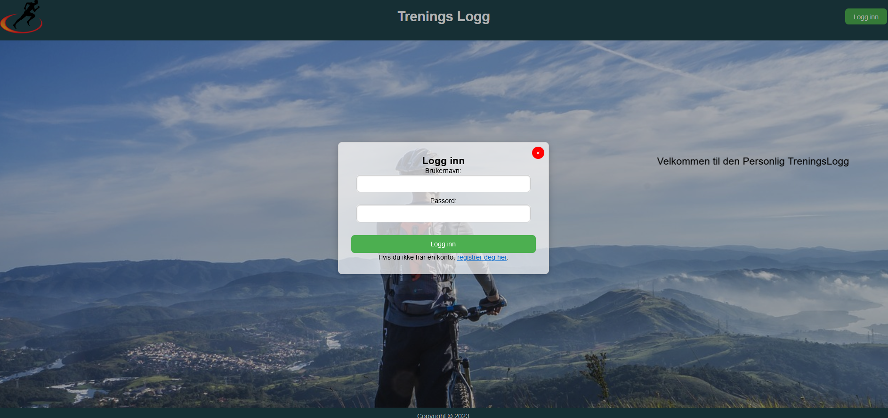

# Workout Logger with Leaflet map

## Mai 2023 - Rebuild Mai 2024

Dette prosjektet er en treningslogg-applikasjon som bruker HTML og JavaScript. Applikasjonen inkluderer funksjoner for brukerregistrering, innlogging, og logging av treningsøkter ved hjelp av Leaflet API for kartfunksjonalitet.

### Innholdsfortegnelse
- [Om prosjektet](#om-prosjektet)
- [Funksjoner](#funksjoner)
- [Installasjon](#installasjon)
- [Bruk](#bruk)
- [Skjermbilder](#skjermbilder)
- [Teknologier brukt](#teknologier-brukt)


### Om prosjektet
Dette prosjektet er en eksamen i JavaScript i Mai 2023, med en oppdatering i Mai 2024(uten å endre så mye på opprinnelig kode). Målet er å lage en brukervennlig treningslogg-applikasjon hvor brukere kan registrere seg, logge inn og legge inn treningsøkter.

### Funksjoner
- **Registrering og innlogging**: Brukere kan registrere seg og logge inn på applikasjonen.
- **Treningslogg**: Brukere kan logge treningsøkter med type trening, varighet og avstand.
- **Kartfunksjonalitet**: Brukere kan legge inn treningsøkter ved å klikke på et kart for å angi posisjon.
- **Sletting av treningsøkter**: Brukere kan slette treningsøkter fra loggen.

### Installasjon
1. **Klon repoet**:
    ```bash
    git clone https://github.com/TommyS-NO/Simple-Workout-Logger.git
    cd Simple-Workout-Logger
    ```
2. **Åpne index.html** 

### Bruk
#### Registrering
1. Åpne applikasjonen og klikk på **Logg inn** knappen.
2. I innloggingsmodalen, klikk på **registrer deg her** lenken.
3. Fyll ut skjemaet med navn, brukernavn og passord, og klikk **Registrer**.

#### Innlogging
1. Åpne applikasjonen og klikk på **Logg inn** knappen.
2. Fyll ut brukernavn og passord, og klikk **Logg inn**.

#### Logging av treningsøkter
1. Klikk på kartet for å sette en markør for treningsøkten din.
2. Fyll ut detaljer i modal som åpnes (type trening, varighet, avstand) og klikk **Legg til Øvelse**.

#### Slette treningsøkter
1. I treningsloggen, klikk **Slett** knappen ved siden av økten du vil fjerne.

### Skjermbilder
#### Frontpage
<div style="display: flex; justify-content: space-between;">
    
    
</div>

#### Profilepage
<div style="display: flex; justify-content: space-between;">
    
    
    
</div>

### Teknologier brukt
- **HTML**
- **CSS**
- **JavaScript**
- **Leaflet API** for kartfunksjonalitet

